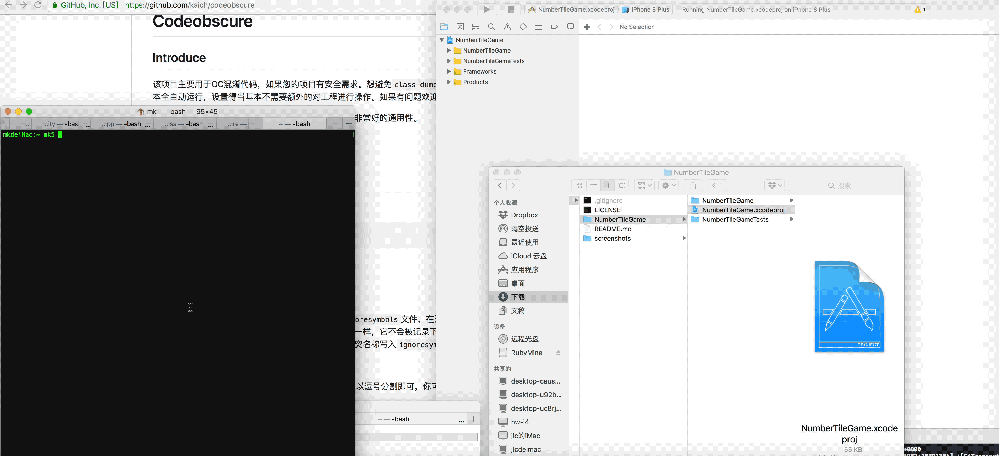
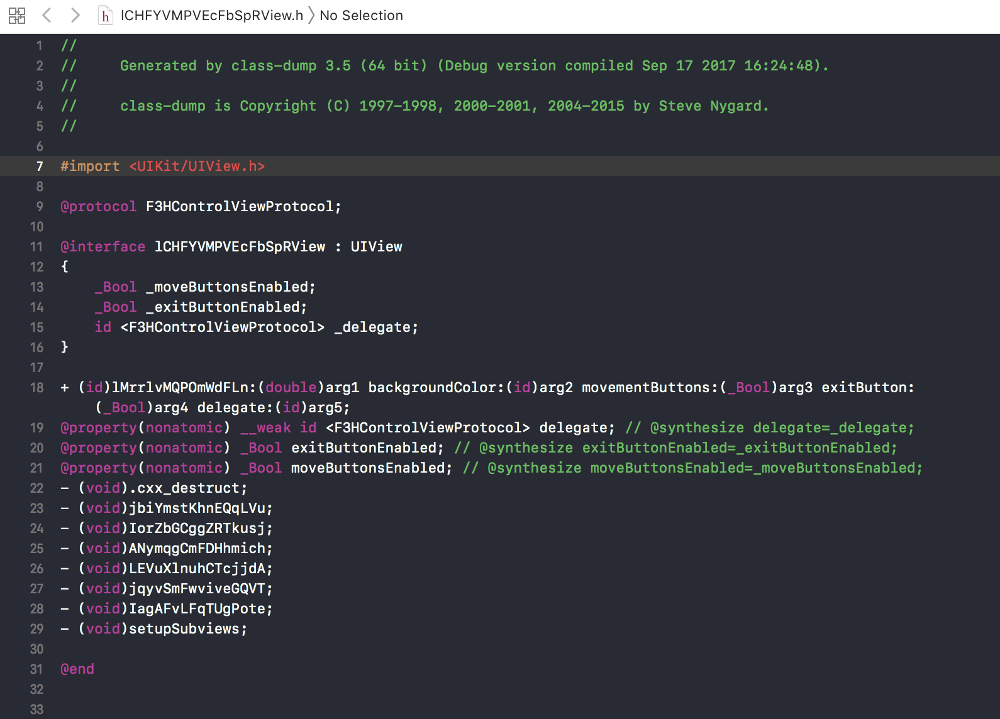

# Codeobscure

## Introduce

该项目主要用于OC混淆代码，如果您的项目有安全需求。想避免`class-dump`来解读您的代码，你不妨使用该项目。该工具基本全自动运行，设置得当基本不需要额外的对工程进行操作。如果有问题欢迎反馈，我会及时修复！ 

该工具经过随机开源项目的测试，测试项目如下，具有非常好的通用性，并且一步完成混淆工作。

* [vanyaland/ToThePenny](https://github.com/vanyaland/ToThePenny)
* [austinzheng/iOS-2048](https://github.com/austinzheng/iOS-2048)

## 演示（项目：iOS-2048）

##  class_dump 效果（项目：iOS-2048）

## Installation

运行如下命令：

    $ gem install codeobscure

## Usage

### 使用实例

使用过程中请使用`绝对路径`。

`-l`可以接多路劲，用逗号分割，如下：		

实例1：混淆方法、类名、属性， 过滤Pods和Download
Example :

	codeobscure -o /Users/mac/Downloads/Examples/Messenger.xcodeproj  -l /Users/mac/Downloads/Examples/Pods,/Users/mac/Downloads/Examples/Download

实例2：仅仅混淆方法和类名

	codeobscure -o /Users/mac/Downloads/Examples/Messenger.xcodeproj -f f,c

实例3：生成ignoresymbols文件，用于写入要过滤的关键字

	codeobscure -i XcodeprojPath	

实例4： 重置-l记录的要过滤的关键字

	codeobscure -r 

实例5：严格模式过滤，并且用单词模式进行替换。(如果代码中含有很多的KVO以及Runtime代码，使用严格模式，会更好的帮助你。)

	codeobscure -o /Users/mac/Downloads/Examples/Messenger.xcodeproj -t w -s
	

***注意:  由于苹果新版系统有[SIP(系统完整性保护)](https://support.apple.com/zh-cn/HT204899)默认是开启的，所以由于安装方式不同，可能在运行命令的时候出现:`attempt to write a readonly database (SQLite3::ReadOnlyException)`的问题。如果出现这个问题，请在命令行上加上`sudo`。***
 
 

### `codeobscure -h` 命令帮助 

使用工具是时候，路径直接用绝对路径，不支持相对路径。（直接把文件拖到终端显示出来的路径就是绝对路径）

	Usage: obscure code for object-c project
    -o, --obscure XcodeprojPath      obscure code
    -l, --load path1,path2,path3     load filt symbols from path
    -r, --reset                      reset loaded symbols
    -f, --fetch type1,type2,type3    fetch and replace type,default type is [c,p,f].c for class,p for property,f for function
    -i, --ignore XcodeprojPath       create a ignore file, you can write your filt symbols in it.eg:name,age ...
	-t, --type replaceType           obscure type = [r,w,c] ,r: random w: random words c: custom replace rule

* -o [Xcodeproj后缀的项目文件].    
* -l [路径] 加载要过滤文件的路劲. 如果你不想混淆某些文件，用这个参数。   
* -r 重置已加载的过滤的字符，-l的过滤文件字符会保存起来，如果你下一次不需要过滤这些文件，请用该命令重置一下.
* -f, --fetch type1,type2,type3    获取需要混淆的类型,默认参数是c,p,f。也就是类名，属性和方法。c代表类名，p代表属性，f代表方法。
* -t r、w、c   替换的文本形式  r：随机字符串  w：单词  c：自定义。自定义模式暂未实现。
* -s 严格模式, 适用于KVO和Runtime比较多的代码。普通代码也可以使用。
 

### 版本说明

* v0.1.2添加`-i`选项，执行这个选项会创建一个`ignoresymbols`文件，在这个文件中填写你要忽略的方法、属性或类名(英文逗号分割)。它仅仅作用于你的这个项目，和`-l`不一样，它不会被记录下来。假设你在`-l`过滤某些名称后，项目中仍然有某些名称冲突了，这个选项更方便你使用它，把冲突名称写入`ignoresymbols`，然后运行`-o`重新生成混淆文件。
* v0.1.3 优化`-l`和`-o`的性能，提高运行速度
* v0.1.4 放宽`ignoresymbols`的格式限制，字段之间以逗号分割即可，你可以为了可读性在字段之间添加空格换行等空白字符。例如

		v0.1.4之前必须如下，否则会过滤识别有问题：
				name,age,sex,nick
		v0.1.4版本:
				name, age ,sex,  nick 
			   以及：
			   name,
			   age,
			   sex,
			   nick
			   
		这些方式都是可以的
* v0.1.5 添加`NSClassFromString`以及`setValue:forKeyPath:`等字段过滤，进一步优化运行出现不识别方法崩溃的情况。添加替换方式[-t]，包括：随机字符 ， 随机单词，自定义替换(目前自定义替换暂未实现，将在0.1.6中实现)
	
		生成结果示例：	
		r ：#define getHeight ZbgTCtOTDmEazebk
		w ：#define getHeight nodulatedBasutoland
		c ：等待实现
注意：由于苹果反馈了如下的被拒信息,因为目前可以用w选项,之后会提供更有意义的单词的替换选项[c]：

* v0.1.6.3 添加了对storyboard的过滤，避免ViewController类被混淆了引起崩溃的问题。注意：如果是xib请自行过滤，在后面版本会添加xib的过滤。
* v0.1.6.5 添加了对xib的过滤，避免ViewController类被混淆了引起崩溃的问题。添加对png等图片资源进行混淆功能。默认开启。
* v0.1.7.0 添加了严格模式。适用于KVO和Runtime较多的代码，普通代码也可以使用。
* v0.1.7.1 避免过度混淆。保留Cell, ViewController等常用关键字。 
* v0.1.7.5 添加#ifndef #endif 避免和已有宏定义冲突。
* v0.1.7.7 修复路径带空格问题

### 使用及原理说明
 
codeobscure主要用于oc（目前来说由于swift的特性摆在那里，这种方式不适用于swift）的项目，利用[iOS安全攻防（二十三）：Objective-C代码混淆](http://blog.csdn.net/yiyaaixuexi/article/details/29201699)的方式去进行代码混淆,纯粹的娱乐自己恶心他人。		

此工具会默认遍历项目属性，方法和类名进行混淆。当然如果简单的进行遍历的话，会产生无穷无尽的错误，`因为你不可能混淆苹果提供给你的官方API，也不能混淆framework和.a的静态编译的库`。所以在混淆代码的时候必须排除掉它们。我已经帮你过滤了系统的方法。如果你的项目中使用Pod或者使用了静态库，或者其他比较特别的第三方库，请使用`codeobscure -l [路径1,路径2..]`的方式去过滤这些库文件。运行`codeobscure -o [项目名.xcodepro]`去调用混淆你的代码，然后耐心等待一会就可以了。
		
当然并不意味这你运行了就一定没错误，该工具最大的简化了混淆代码的工作，由于不同的人编写的代码可能各不相同。假设你调用了`NSClassFromString("classNameA")`而这个类正好被混淆了，它不识别classNameA到底是什么。那么怎么解决这个错误呢。最简单的方式就是在`codeObfuscation.h`中查询classNameA并删除它的#define即可。		

在0.1.3中，你并不要简单的删掉它，而是先运行`codeobscure -i XcodeprojPath`去生成`ignoresymbols`。然后把需要进一步过滤的某些名字直接添加进入，用英文逗号分隔开来。例如上面你要删除的，如果你仅仅是删除了，下次要执行`codeobscure -o`重新生成的时候会又重新生成，你要再次把它从`codeObfuscation.h`中查询出来并删除。v0.1.3中你仅仅添加到`ignoresymbols`就可以很方便的解决这一问题。下次`codeobscure -o`生成的时候回自动过滤到这些字段。

我测试的项目是有打几年历史的一个项目，代码也挺多的。合理的过滤掉某些不应该混淆的方法。提示错误的仅仅只有一个地方,然后就是运行的时候有几处崩溃，都是因为方法被混淆了，不识别方法导致的，仅仅删除它就可以了。运行完成后，除了解决错误，你不需要进行额外的文件添加删除操作，我已帮你添加好了。你觉得代码混淆不好用，那么直接删除codeObfuscation.h就行了。此致，敬礼！	

注意：如果你运行了`codeobscure -l [路径1,路径2..]`,那么它会记录下来要过滤的东西。如果你下次不想过滤已经过滤的库，运行`codeobscure -r`来重置。

如果有什么不好用的地方，直接写到issue，我会尽量让它更好用。
  

## Contributing

Bug reports and pull requests are welcome on GitHub at https://github.com/kaich/codeobscure. This project is intended to be a safe, welcoming space for collaboration, and contributors are expected to adhere to the [Contributor Covenant](http://contributor-covenant.org) code of conduct.

## License

The gem is available as open source under the terms of the [MIT License](http://opensource.org/licenses/MIT).

